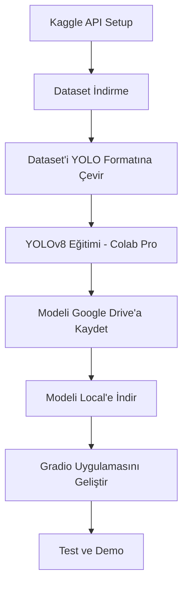

# 🛩️ Military Aircraft Recognition - YOLOv8 + Gradio

## Genel Bakış

Bu proje, Kaggle'daki **MilitaryAircraftDetectionDataset** kullanılarak YOLOv8 ile askeri uçak tespiti yapan bir model geliştirilmesini ve bu modelin Gradio ile basit bir web demo olarak sunulmasını hedefler.

**Proje Kararları:**

- Model: Ultralytics YOLOv8 (Object Detection)
- Eğitim Ortamı: Google Colab Pro (GPU desteği için)
- Deployment: Gradio web uygulaması (resim yükleme + video yükleme)
- Dataset: Kaggle API ile indirilecek

---

## Proje Yapısı

```
military_aircraft_recognition/
├── plans/
│   └── plan.md                    # Bu plan dokümanı
├── colab_notebooks/
│   └── military_aircraft_yolov8_training.ipynb   # Colab eğitim notebook'u
├── app/
│   ├── requirements.txt           # Python bağımlılıkları
│   ├── gradio_app.py              # Gradio ana uygulama
│   ├── utils.py                   # Yardımcı fonksiyonlar
│   └── models/                    # İndirilen model ağırlıkları (gitignore)
└── README.md                      # Proje dokümantasyonu
```

---

## Aşama 1: Colab'da Model Eğitimi

### 1.1 Kaggle API Kurulumu (Adım Adım)

1. Kaggle hesabına giriş yap -> Settings -> API -> "Create New API Token"
2. İndirilen `kaggle.json` dosyasını Colab'a yükle
3. API ile dataset'i indir

### 1.2 Dataset'in İncelenmesi ve Hazırlanması

Dataset'in mevcut formatı kontrol edilecek. Genelde bu dataset şu yapıdadır:

- Görseller (`.jpg` veya `.png`)
- Annotasyonlar (`.xml` Pascal VOC formatı veya `.txt` YOLO formatı)

Eğer Pascal VOC formatındaysa, YOLO formatına dönüştürme script'i yazılacak.

### 1.3 Veri Seti Düzenleme (YOLO Formatına Çevirme)

YOLO formatı şu şekilde olmalı:

```
dataset/
├── train/
│   ├── images/       # Eğitim görselleri
│   └── labels/       # Eğitim etiketleri (.txt)
├── val/
│   ├── images/       # Doğrulama görselleri
│   └── labels/       # Doğrulama etiketleri (.txt)
└── data.yaml         # Sınıf isimleri ve yollar
```

### 1.4 YOLOv8 Eğitimi

- Model: `yolov8m.pt` veya `yolov8l.pt` (orta/büyük model)
- Colab Pro GPU ile ~1-3 saat eğitim
- Hiperparametreler: `imgsz=640, batch=16, epochs=100`
- Early stopping ile en iyi model checkpoint'i kaydedilecek
- Eğitim metrikleri (mAP, precision, recall) takip edilecek

### 1.5 Model Export

- Eğitilmiş model (`best.pt`) Google Drive'a kaydedilecek

---

## Aşama 2: Local Gradio Web Demo

### 2.1 Proje Bağımlılıkları

```txt
ultralytics==8.3.0
gradio
opencv-python-headless
Pillow
numpy
```

### 2.2 Gradio Uygulaması Özellikleri

**Giriş Ekranı:**

- Başlık ve proje açıklaması
- Kullanıcı seçeneği: Resim Yükle / Video Yükle (Gradio `gr.Tab()` ile)

**Resim Yükleme (sekme):**

- `gr.Image()` ile resim yükleme
- YOLOv8 modeli tespit yapar
- Bounding box'lar ve sınıf isimleri görsel üzerinde gösterilir
- Güven skoru (confidence) her kutu için yazılır

**Video Yükleme (sekme):**

- `gr.Video()` ile video yükleme
- OpenCV ile frame'lere ayrıştırılır
- Her frame'de (veya her N frame'de) YOLOv8 inference çalıştırılır
- Tespit edilen bounding box'lar ile frame'ler tekrar birleştirilir
- İşlenmiş video `gr.Video()` ile gösterilir
- `gr.Progress()` ile ilerleme çubuğu gösterilir

### 2.3 Model Entegrasyonu

- `best.pt` dosyası Google Drive'dan indirilip `app/models/` klasörüne konulur
- `ultralytics.YOLO` ile model yüklenir
- Inference sonuçları `result.plot()` ile görselleştirilir

---

## Teknik Kararlar ve Gerekçeler

| Karar           | Seçim        | Gerekçe                                                                          |
| --------------- | ------------ | -------------------------------------------------------------------------------- |
| Eğitim Yeri     | Colab Pro    | GPU yok (T4/P100), ücretsiz Colab'dan daha hızlı                                 |
| Model           | YOLOv8       | Stabil, bol doküman, Gradio entegrasyonu kolay                                   |
| Dataset Erişimi | Kaggle API   | Manuel indirme/yüklemeden daha hızlı                                             |
| Demo Platformu  | Gradio       | Native video desteği, ML demo için optimize, HuggingFace Spaces ile kolay deploy |
| Veri Formatı    | YOLO formatı | Ultralytics'in native formatı                                                    |

---

## Zaman Akışı



---

## Notlar / Önemli Noktalar

1. **Kaggle API**: `kaggle.json` dosyasındaki `username` ve `key` Colab notebook'a eklenecek
2. **Google Drive Bağlantısı**: Colab'da `drive.mount()` ile Drive bağlanacak, model ağırlıkları oraya kaydedilecek
3. **Dataset Boyutu**: Yaklaşık ~1-3 GB arası, Colab'da sorun olmaz
4. **Epoch Sayısı**: Early stopping ile 50-100 epoch arası, mAP değeri plato yapınca duracak
5. **Video İşleme**: Uzun videolarda frame atlama stride değeri ayarlanabilir, tüm frame'lerde inference yerine her N frame'de bir inference yapılabilir
6. **HuggingFace Spaces**: İstenirse Gradio uygulaması HuggingFace Spaces'e ücretsiz deploy edilebilir
